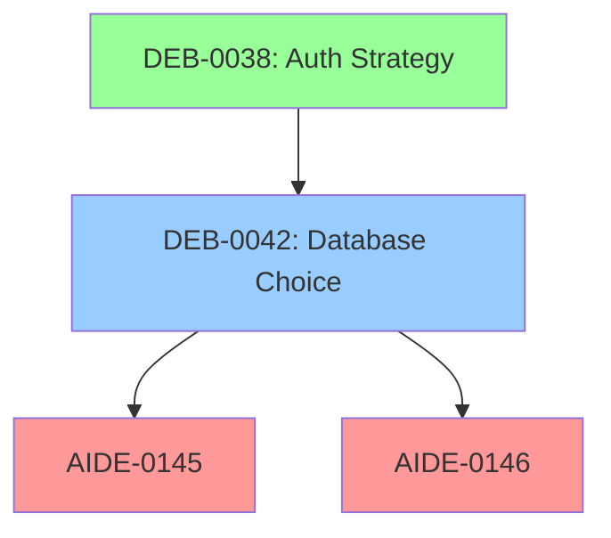

# adrAI: AIDE Debate Tracking System

**High-Level Plan for Review-Triggered Collaborative Decision Support**

---

## Problem Statement

AI-assisted engineering has dramatically increased development velocity, but human review processes haven't kept pace. The core tension:

```
AI creates plans/code (fast) → Human must validate (slow, tedious) → Bottleneck
```

Specific pain points:
- Multiple parallel architecture debates happening simultaneously
- Dependencies between debates create a mesh that's hard to track
- Single-person reviews insufficient for complex systems
- ADRs capture decisions but not the debate journey
- **Humans validating AI output is tedious and error-prone**
- AI can't help humans review AI output effectively

## Proposed Solution: adrAI

Extend AIDE with a **Review-Triggered Debate System** that:

1. **Spawns debates from reviews** - Plan/code reviews trigger structured discussions
2. **Structured debate artifacts** in-repo (Argdown-compatible Markdown in docs/)
3. **AI-aided review** - AI helps humans validate AI-generated content on demand
4. **Dependency mesh** - Track blocking relationships across debates
5. **LINK integration** - DEB-NNNN identifiers tie into AIDE traceability

**Key insight:** The system serves the review bottleneck. AI creates, humans validate, AI helps humans validate efficiently.

## Implementation Scope

**Phase 1: adrai-specific** - Build and validate in this project first
**Phase 2: Generalize** - Extract patterns to AIDE-blueprint for community

---

## Core Architecture

### 1. Debate Artifact Hierarchy

```
QUESTION (Open Problem)
    └── THESIS A (Proposed Answer)
    │       ├── CLAIM (+pro)
    │       │       └── SUB-CLAIM, EVIDENCE
    │       └── CLAIM (-con)
    └── THESIS B (Alternative)
    └── RESOLUTION → ADR → AIDE Plan
```

### 2. LINK Integration

| Artifact | ID Pattern | Example |
|----------|------------|---------|
| Debate | DEB-NNNN | DEB-0042 |
| Plan | AIDE-NNNN | AIDE-0145 |
| Decision | ADR-NNN | ADR-015 |

**Traceability chain:**
```
DEB-0042 (debate) → ADR-015 (decision) → AIDE-0145 (implementation)
```

### 3. Debate File Format

```markdown
# DEB-0042: Database Technology Selection

> **Status:** Draft | Active | Blocked | Deciding | Resolved
> **Owner:** @architect
> **Depends On:** DEB-0038
> **Blocks:** AIDE-0145, AIDE-0146

## The Question
[Central Question]: Which database for order management?

## Theses

### Thesis A: PostgreSQL
+ [Battle-tested]: Decades of production usage
  - <Scaling concern>: Write throughput limits

### Thesis B: CockroachDB
+ [Horizontal scaling]: Native distributed
- [Team unfamiliarity]: 2-3 week ramp-up

## Evidence
[Benchmarks, assessments, references]

## Resolution
**Decision:** [pending]
**Produces:** ADR-XXX, unblocks AIDE-0145
```

### 4. Lifecycle State Machine

```
DRAFT → ACTIVE → BLOCKED/DECIDING → RESOLVED
                         ↓
                    SUPERSEDED
```

| State | Description |
|-------|-------------|
| Draft | Owner structuring question/theses |
| Active | Team contributing arguments |
| Blocked | Waiting on dependent debate |
| Deciding | Voting period, no new arguments |
| Resolved | Decision made, produces ADR |

### 5. Dependency Mesh

```yaml
# debates/.deb-graph.yaml
DEB-0038:
  status: resolved
  blocks: [DEB-0042]

DEB-0042:
  status: active
  depends_on: [DEB-0038]
  blocks: [AIDE-0145, AIDE-0146]
```

**Operations:**
- Critical path: "What must resolve before AIDE-0145?"
- Impact analysis: "If DEB-0042 chooses CockroachDB, what's affected?"

### 6. Collaboration Model

| Role | Permissions |
|------|-------------|
| Owner | Create, manage lifecycle |
| Contributor | Add claims, vote |
| Reviewer | Comment, flag issues |
| Decider | Make final resolution |

**Risk-based approval:**
- Low: Owner decides
- Medium: Owner + 1 reviewer
- High: Architect + Tech Lead
- Critical: Architect + Lead + PM

### 7. AI-Aided Review Skills

The core insight: **AI creates content, humans validate, AI helps humans validate efficiently.**

| Skill | Purpose | Invocation |
|-------|---------|------------|
| `review-assist` | On-demand help during review | "Help me review AIDE-0145" |
| `debate-summarize` | Current debate state | "Summarize DEB-0042" |
| `debate-analyze` | Find gaps, inconsistencies | "Analyze DEB-0042 for issues" |
| `debate-impact` | Resolution consequences | "Impact of choosing Thesis A?" |
| `cross-check` | Consistency across debates | "Does this conflict with DEB-0038?" |

**Review Assist Examples:**
```
Human: "Help me review AIDE-0145"
AI: "Key things to verify in this plan:
     1. Does the database choice align with DEB-0042 (still open)?
     2. The latency claim of <10ms lacks benchmark evidence
     3. Rollback strategy assumes PostgreSQL, conflicts with CockroachDB option
     4. Test scenarios don't cover failure modes mentioned in risks"
```

**AI boundaries:**
- CAN: Analyze, summarize, flag issues, suggest questions
- CANNOT: Vote, resolve, approve plans, add arguments without human review
- PRINCIPLE: AI amplifies human judgment, doesn't replace it

---

## Conceptual Foundations

### A. Review Trigger Criteria: When Review → Debate

**Core Principle:** A review spawns a debate when **reasonable experts could disagree**. Simple approve/reject suffices when review is **verification**, not **judgment**.

#### The 7-Gate Decision Flow

```
START: Review triggered (CICD, ceremony, code review, spot-check)
                              │
┌─────────────────────────────┴─────────────────────────────┐
│ GATE 1: Automatic Escalation                              │
│ Matches critical file patterns? (auth/*, security/*, etc)│
└───────────────────────────────────────────────────────────┘
        │ Yes → DEBATE                │ No ↓
┌───────────────────────────────────────────────────────────┐
│ GATE 2: Risk Level Check                                  │
│ Is AIDE risk level Critical?                              │
└───────────────────────────────────────────────────────────┘
        │ Yes → DEBATE                │ No ↓
┌───────────────────────────────────────────────────────────┐
│ GATE 3: Stakeholder Disagreement                          │
│ Have reviewers expressed conflicting views?               │
└───────────────────────────────────────────────────────────┘
        │ Yes → DEBATE                │ No ↓
┌───────────────────────────────────────────────────────────┐
│ GATE 4: Precedent Check                                   │
│ Does this set a new pattern others will follow?           │
└───────────────────────────────────────────────────────────┘
        │ Yes → DEBATE                │ No ↓
┌───────────────────────────────────────────────────────────┐
│ GATE 5: Reversibility Check                               │
│ Is the change difficult/impossible to reverse?            │
└───────────────────────────────────────────────────────────┘
        │ Yes → DEBATE                │ No ↓
┌───────────────────────────────────────────────────────────┐
│ GATE 6: Complexity Score ≥ 10?                            │
│ (alternatives + trade-offs + knowledge gap + time horizon)│
└───────────────────────────────────────────────────────────┘
        │ Yes → DEBATE                │ No ↓
┌───────────────────────────────────────────────────────────┐
│ GATE 7: Author Request                                    │
│ Has author flagged uncertainty?                           │
└───────────────────────────────────────────────────────────┘
        │ Yes → DEBATE                │ No → SIMPLE REVIEW
```

#### Complexity Score (0-18 scale)

| Factor | 0 | 1 | 2 | 3 |
|--------|---|---|---|---|
| **Alternative Count** | Single obvious | 2 options | 3+ options | No frontrunner |
| **Trade-off Severity** | None | Minor | Significant | Irreversible |
| **Stakeholder Disagreement** | None | Questions | Opinions | Explicit conflict |
| **Precedent Setting** | Follows pattern | Minor deviation | New for domain | Platform-wide |
| **Knowledge Gap** | Team knows | Brief learning | Research needed | Expert required |
| **Time Horizon** | Days/weeks | Months | Years | Permanent |

**Threshold:** Score ≥ 10 → Debate recommended

#### Quick Reference

| Condition | Action |
|-----------|--------|
| All aligned, simple change | **APPROVE** |
| Any reviewer disagreement | **DEBATE** |
| Security/auth touched | **DEBATE** |
| Multiple services affected | **DEBATE** |
| New pattern/precedent | **DEBATE** |
| Irreversible decision | **DEBATE** |
| Author uncertain | **DEBATE** |

---

### B. Artifact Lineage: "Why Does This Exist?"

**Problem:** Too many documents, no indicator of what's important.
**Solution:** Every artifact declares its scope, parent, and purpose.

#### Scope Taxonomy (6 Levels)

```
REQ (Requirement)     "What we need"
 │
 └── CON (Concept)    "How we think about it"  ← Debates live here
      │
      └── ARC (Architecture)  "Structural decisions"  ← ADRs live here
           │
           └── DES (Design)   "Detailed approach"  ← AIDE Plans live here
                │
                └── IMP (Implementation)  "Code"
                     │
                     └── VER (Verification)  "Tests"
```

| Scope | Code | Artifacts | Default Debate? |
|-------|------|-----------|-----------------|
| Requirement | `REQ` | Vision, Goals, User Stories | If alignment unclear |
| Concept | `CON` | Debates, Research, Spikes | **Yes** (this is where debates live) |
| Architecture | `ARC` | ADRs, System diagrams | Almost always |
| Design | `DES` | AIDE Plans, Interface specs | If multiple approaches |
| Implementation | `IMP` | Code files, Commits | If strategy disputed |
| Verification | `VER` | Tests, Benchmarks | Rarely |

#### Lineage Header Block

Every artifact gets a Lineage section answering "Why does this exist?":

```markdown
## Lineage

| Field | Value |
|-------|-------|
| **Scope** | DES (Design) |
| **Parent** | [ADR-015](../docs/adr/ADR-015.md) |
| **Purpose** | Implements JWT validation as decided in ADR-015 |
| **Supersedes** | None |
| **Blocked By** | [DEB-0042](../debates/DEB-0042.md) |
```

#### Importance Signals

Surface "what matters NOW" with computed signals:

| Signal | Formula | Display |
|--------|---------|---------|
| **Blocking** | Count of artifacts waiting | "Blocks: 3 items" |
| **Staleness** | Days open without resolution | "Stale: 14 days" |
| **Attention** | Key stakeholders watching | "@architect, @pm" |
| **Velocity** | Git commits in last 7 days | "Active: 5 changes" |

**Importance Score** (for triage):
```
importance = (blocking_count × 20) + (days_stale × 2) + (attention_tags × 5)
```

#### Lineage Chain Example

```
docs/goals.md (OBJ-003)         [REQ] "Improve user self-service"
    │
    └── debates/DEB-0038.md     [CON] "How should we implement SSO?"
         │
         └── docs/adr/ADR-015.md [ARC] "Decision: Use JWT"
              │
              └── plans/AIDE-0145.md [DES] "JWT implementation plan"
                   │
                   └── services/auth/processor.go [IMP]
                        │
                        └── services/auth/processor_test.go [VER]
```

---

### C. Dependency Mesh Operations

The `.deb-graph.yaml` stores the dependency mesh. Six core operations traverse it:

#### Graph Schema

```yaml
# debates/.deb-graph.yaml
version: "1.0"

nodes:
  debates:
    DEB-0042:
      status: active
      owner: "@architect"
      created: "2026-01-20"
      priority: 2
      stakeholders: ["@dev1", "@pm", "@architect"]

  plans:
    AIDE-0145:
      status: blocked
      blocked_since: "2026-01-20"

edges:
  blocks:
    DEB-0038: [DEB-0042]
    DEB-0042: [AIDE-0145, AIDE-0146, ADR-015]

  blocked_by:  # Auto-generated inverse index
    DEB-0042: [DEB-0038]
    AIDE-0145: [DEB-0042]
```

#### Six Core Operations

| Operation | Question | Algorithm | Output |
|-----------|----------|-----------|--------|
| **Critical Path** | "What must resolve before AIDE-0145?" | Reverse topological sort | `[DEB-0038, DEB-0042]` |
| **Impact Analysis** | "If DEB-0042 resolves as Thesis A?" | Forward BFS | Unlocked: 3, Conflicts: 1 |
| **Resolution Order** | "Best sequence to resolve?" | Weighted topological sort | Priority queue |
| **Cycle Detection** | "Any circular dependencies?" | Three-color DFS | Error + cycle path |
| **Staleness Detection** | "What's blocking progress?" | Multi-factor scoring | Priority list |
| **What-If Analysis** | "Simulate resolving DEB-0042" | Graph snapshot + sim | Before/after comparison |

#### Critical Path Example

```
Query: criticalPath("AIDE-0145")

Graph: DEB-0038 → DEB-0042 → AIDE-0145

Result: ["DEB-0038", "DEB-0042"]
        ↑ resolve first  ↑ then this
```

#### Staleness Score Formula

```
staleness = (age_days × 3) + (blocked_count × 15) + (stakeholder_count × 5)
            × priority_multiplier

priority_multiplier = {1: 2.0, 2: 1.5, 3: 1.0, 4: 0.75}
```

#### Mermaid Visualization

Auto-generated from `.deb-graph.yaml`:



---

## File System Layout

```
project/
├── debates/
│   ├── .deb-tracker.md           # ID allocation
│   ├── .deb-graph.yaml           # Dependency mesh
│   ├── DEB-NNNN-topic.deb.md     # Debate files
│   └── archive/                  # Resolved >90 days
├── plans/
│   └── AIDE-NNNN.md              # + "Blocked by: DEB-NNNN"
└── docs/
    ├── adr/
    │   └── ADR-NNN.md            # + "Resolved by: DEB-NNNN"
    └── ai-coding/
        ├── 06-templates/
        │   └── debate-template.md
        └── 09-debates/
            └── README.md, lifecycle.md
```

---

## Review-Triggered Debate Flow

```
┌─────────────────────────────────────────────────────────────────┐
│                    AIDE PTC Loop                                 │
│  AI creates PLAN → AI creates TEST → AI creates CODE            │
└─────────────────────────────────────────────────────────────────┘
                              │
                              ▼
┌─────────────────────────────────────────────────────────────────┐
│                    REVIEW TRIGGERS                               │
│  • CICD gate (automated)                                         │
│  • Plan Review ceremony (ritual)                                 │
│  • Code review (manual)                                          │
│  • Architect spot-check (ad-hoc)                                 │
└─────────────────────────────────────────────────────────────────┘
                              │
            ┌─────────────────┴─────────────────┐
            ▼                                   ▼
     Simple: Approve/Reject            Complex: Spawn Debate
            │                                   │
            ▼                                   ▼
        Continue                    ┌───────────────────┐
                                    │  DEB-NNNN created │
                                    │  in docs/debates/ │
                                    └───────────────────┘
                                            │
                    ┌───────────────────────┴───────────────┐
                    ▼                                       ▼
            Human contributes              AI assists review on demand
            arguments/concerns             • Summarize debate state
                    │                      • Identify gaps in reasoning
                    │                      • Check cross-debate consistency
                    │                      • Highlight risks
                    └───────────────────────┬───────────────┘
                                            ▼
                                    ┌───────────────────┐
                                    │    RESOLUTION     │
                                    │  → ADR created    │
                                    │  → Plan unblocked │
                                    └───────────────────┘
```

---

## Implementation Phases

### Phase 1: Foundation (Manual Process) ✅ COMPLETE
**Goal:** Establish debate artifacts and basic workflow

- [x] Create debate template in `docs/debates/templates/`
- [x] Create `.deb-tracker.md` for ID allocation
- [x] Add `Blocked by: DEB-NNNN` field to plan template
- [x] Document lifecycle in `docs/debates/README.md`
- [x] Create `.deb-graph.yaml` structure for dependencies
- [x] Define review triggers (when does a review spawn a debate?)

### Phase 1.5: Review Annotation System ✅ COMPLETE
**Goal:** Personal annotation layer for artifacts during review

- [x] VS Code extension `adts-review-notes` in `tools/adts-review-notes/`
- [x] Sidebar panel showing notes grouped by status/type
- [x] Commands: Add Note, Add Location, Promote to Debate, Resolve
- [x] Multi-location linking (one note → multiple files)
- [x] Personal storage in `~/.adts/review-notes.yaml` (gitignored)
- [x] Promotion workflow to create DEB-NNNN from notes
- [x] Documentation in `docs/debates/review-workflow.md`

### Phase 2: Review Integration
**Goal:** Connect debates to AIDE review ceremonies

- [ ] Add debate spawn criteria to Plan Review ceremony
- [ ] Add "needs debate" flag to CICD review gates
- [ ] Extend traceability matrix for debates
- [ ] Create validation script (`check-debates.sh`)
- [ ] Define escalation: simple review → debate → ADR

### Phase 3: AI-Aided Review
**Goal:** AI helps humans validate AI output efficiently

- [ ] `review-assist` - On-demand help during human review
  - "What should I look for in this plan?"
  - "Are there gaps in this reasoning?"
  - "Does this conflict with ADR-015?"
- [ ] `debate-summarize` - Current state for busy reviewers
- [ ] `debate-analyze` - Gap and consistency detection
- [ ] Cross-debate impact checking

### Phase 4: Automation & Tooling
**Goal:** Reduce friction, increase visibility

- [ ] CI integration for debate health checks
- [ ] Mermaid diagram generation from `.deb-graph.yaml`
- [ ] Stale debate notifications
- [ ] `debate-create` from review comments

---

## Success Metrics

| Metric | Target |
|--------|--------|
| Decision velocity | 50% faster question→resolution |
| Traceability | 100% debates linked to ADR/Plan |
| Participation | >80% relevant stakeholders |
| Revisit rate | <10% decisions superseded |

---

## Key Design Decisions

1. **Argdown-compatible syntax** - Fits dev/Markdown workflows
2. **Repo-first** - Debates live in version control, not external tools
3. **LINK integration** - Unified traceability with AIDE artifacts
4. **AI as participant, not decider** - Human accountability preserved
5. **Dependency mesh** - Explicit blocking relationships
6. **Risk-based governance** - Matches AIDE approval patterns

---

## Resolved Questions

1. **Scope**: ✅ adrai-specific first, then generalize to AIDE-blueprint
2. **Visualization**: ✅ Generated static site with argument maps + dependency dashboard
3. **Trigger mechanism**: ✅ Reviews spawn debates (CICD gates, ceremonies, manual)
4. **AI focus**: ✅ AI-aided review - help humans validate AI output efficiently
5. **Review criteria**: ✅ 7-Gate decision flow (see Conceptual Foundations A)
6. **Lineage**: ✅ Scope taxonomy + "Why does this exist?" header (see Conceptual Foundations B)
7. **Graph operations**: ✅ 6 core algorithms for mesh traversal (see Conceptual Foundations C)
8. **Debate format**: ✅ Full Argdown syntax for technical users
9. **UI for non-technical users**: ✅ Static site with argument maps + dashboard views
10. **Collaboration analytics**: ✅ Participation patterns, alignment/conflict, resolution velocity
11. **Annotation implementation**: ✅ Custom VS Code Extension (tools/adts-review-notes/)
12. **Note types**: ✅ Five types - question, uncertainty, concern, bookmark, pre-debate
13. **Annotation storage**: ✅ `~/.adts/review-notes.yaml` (gitignored, personal)

## Remaining Questions

1. **Migration**: How to backfill lineage for existing artifacts?
2. **SSG choice**: Astro vs Eleventy for static site generation?
3. **Hosting**: GitHub Pages vs Cloudflare Pages?

---

## Graphical UI Specification

### Two Views for Non-Technical Stakeholders

**View 1: Argument Maps**
- Visual debate trees showing claims, pros/cons, evidence
- Interactive node expansion
- Uses Argdown's native web component generation
- Drill into specific debates to see full reasoning

**View 2: Dependency Dashboard**
- Portfolio overview of all debates
- Status cards (Draft/Active/Blocked/Resolved)
- Mermaid graphs for blocking relationships
- Stale/urgent indicators with importance scores

### Collaboration Analytics

| Analysis | Purpose | Visualization |
|----------|---------|---------------|
| **Participation Patterns** | Who's contributing, who's silent | Activity heatmap, contributor counts |
| **Alignment/Conflict** | Stakeholder agreement on theses | Preference matrix, conflict hotspots |
| **Resolution Velocity** | Time-to-decision metrics | Trend charts, bottleneck identification |

### Tech Stack

- **Static Site Generator**: Astro or Eleventy
- **Argument Maps**: Argdown CLI (`@argdown/node`) → HTML/web components
- **Dependency Diagrams**: Mermaid
- **Analytics Charts**: Chart.js or similar
- **Deployment**: GitHub Pages or Cloudflare Pages
- **Build Trigger**: CI on merge to main

---

## Verification

To validate Phase 1 (Foundation):
1. Create `docs/debates/` directory structure
2. Create debate template with Argdown-compatible syntax
3. Create sample debate DEB-0001 (a real pending decision in adrai)
4. Link to existing AIDE plan with `Blocked by: DEB-0001`
5. Walk through lifecycle manually: Draft → Active → Resolved
6. Generate ADR from resolution
7. Test `.deb-graph.yaml` with manual Mermaid diagram
8. Run `review-assist` on a real AIDE plan to test AI-aided review

**Success criteria:**
- Team can create debates without friction
- Blocking relationships are clear and trackable
- AI can provide useful review assistance on demand

---

## References

- [Argdown](https://argdown.org/) - Structured argumentation syntax
- [Kialo](https://www.kialo.com/) - Collaborative debate platform
- AIDE-blueprint - AI Driven Engineering methodology
