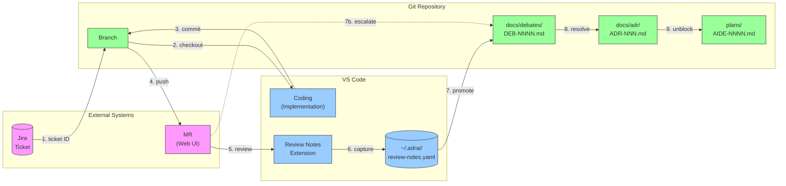

# adrai Future Vision

> Eliminating media breaks to preserve developer flow and context.

**Related:** [Goal 6: Media Break Elimination](../FOUNDATIONS.md#goal-6-media-break-elimination)

---

## The Problem: Media Breaks

Every time context transfers between tools, information is lost:

| # | Transition | Friction | Context Lost |
|---|------------|----------|--------------|
| 1 | Jira → Branch | Copy ticket ID manually | Ticket description, acceptance criteria |
| 4 | Branch → MR Web | Push then switch to browser | Local context, uncommitted thoughts |
| 5 | MR Web → VS Code | Click review, switch apps | Comments thread position |
| 7 | Notes → Debate | Manual promotion | Personal reasoning, timing |
| 7b | MR → Debate | Manual escalation | Discussion history |
| 8 | Debate → ADR | Manual resolution | Debate nuances, minority views |
| 9 | ADR → Plan | Manual unblocking | Timing, related decisions |

Engineers mentally re-load state at each break. This friction compounds—the more AI accelerates creation, the more painful validation becomes.

Context transfers between tools at key transition points:



**Legend:**
- **Pink:** External web interfaces (context leaves developer's machine)
- **Blue:** VS Code / local tools (personal workspace)
- **Green:** Git repository (shared, version-controlled)

**Future:** See [adrai Future Vision](adrai-concepts/adrai-future-vision.md) for the roadmap to eliminate these breaks.


---

## The Vision: Seamless Flow

```
Developer never leaves VS Code.
Context flows automatically.
AI handles mundane transfers.
Humans focus on decisions.
```

---

## Roadmap

### Phase 1: Bridge the Gaps (v1.x)

Reduce manual copying between existing tools.

| Break | Solution | Status |
|-------|----------|--------|
| Jira → Branch | CLI: `adrai start CIPRENGTL-1234` auto-creates branch with ticket context | Planned |
| MR → Debate | "Escalate to Debate" button in GitLab Workflow extension | Planned |
| ADR → Plan | Notification when blocking debate resolves | Planned |

### Phase 2: Unified Review Surface (v2.x)

Bring external interfaces into VS Code.

| Break | Solution | Status |
|-------|----------|--------|
| MR Web ↔ VS Code | Full MR review in VS Code (comments, approvals, discussions) | Planned |
| Debate → ADR | Auto-generate ADR draft from resolved debate | Planned |
| Notes → Debate | Batch promotion with context grouping | Planned |

### Phase 3: Context-Preserving Flow (v3.x)

AI maintains context across all transitions.

| Break | Solution | Status |
|-------|----------|--------|
| All transitions | AI maintains running context summary | Planned |
| Jira ↔ Repo | Bidirectional sync (ticket status ↔ plan status) | Planned |
| Personal ↔ Shared | Selective sharing with attribution | Planned |

---

## Success Metrics

| Metric | Baseline | Target | Due |
|--------|----------|--------|-----|
| Media breaks requiring manual copy | 7 | 2 | 2026-Q3 |
| Context preserved across transitions | 0% | 80% | 2026-Q4 |

---

## Related Documents

- [WORKFLOWS.md - Media Breaks Diagram](../WORKFLOWS.md#media-breaks)
- [FOUNDATIONS.md - Goal 6](../FOUNDATIONS.md#goal-6-media-break-elimination)
- [Software Architecture](adrai-software-architecture.md)
