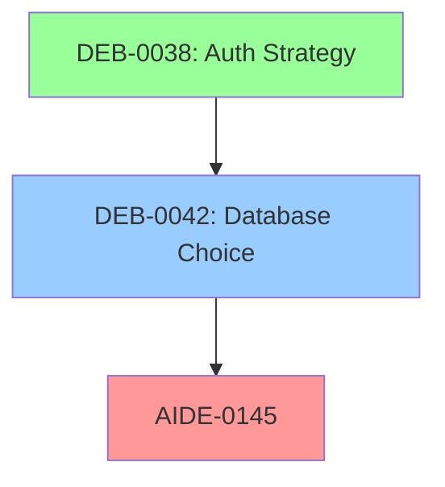

# adrAI: Debate Tracking System

Structured debates for complex decisions in AI-assisted engineering.

---

## Overview

adrAI extends AIDE with a **review-triggered debate system** that:

1. **Spawns debates from reviews** when reasonable experts could disagree
2. **Tracks "why does this exist"** through scope taxonomy and lineage
3. **Manages dependency mesh** with blocking relationships
4. **Provides AI-aided review** to help humans validate AI output

**Core insight:** AI creates fast, humans validate slow. adrAI structures the validation process.

---

## Quick Start

### Personal Review Annotations

Before creating formal debates, capture thoughts during review:

1. **Install VS Code extension** from `tools/adrai-review-notes/`
2. Press **Ctrl+Shift+N** to add a note at current cursor
3. Triage notes in the sidebar panel
4. **Promote to debate** when discussion is warranted

See [Review Workflow](review-workflow.md) for the full annotation → debate process.

### Creating a Debate

1. **Check if debate is warranted** using the 7-Gate Flow (see below)
2. **Get next ID** from `.deb-tracker.md`
3. **Copy template** from `templates/debate-template.md`
4. **Save as** `DEB-NNNN-topic-name.deb.md`
5. **Update tracker** with new entry
6. **Update graph** in `.deb-graph.yaml` if blocking relationships exist

### File Locations

```
docs/debates/
├── README.md                  # This file
├── review-workflow.md         # Annotation → debate workflow
├── argdown-guide.md           # Argdown syntax reference
├── .deb-tracker.md            # ID allocation tracker
├── .deb-graph.yaml            # Dependency mesh
├── templates/
│   └── debate-template.md     # Full template with Argdown
├── DEB-NNNN-topic.deb.md      # Active debates
└── archive/                   # Resolved debates (>90 days)

~/.adrai/
└── review-notes.yaml          # Personal annotations (gitignored)
```

---

## When to Create a Debate

### The 7-Gate Decision Flow

A review spawns a debate when **reasonable experts could disagree**.

```
START: Review triggered
           │
    ┌──────┴──────┐
    │  GATE 1     │ Critical file patterns? (auth/*, security/*)
    └─────────────┘
         │ Yes → DEBATE        │ No ↓
    ┌─────────────┐
    │  GATE 2     │ AIDE risk level Critical?
    └─────────────┘
         │ Yes → DEBATE        │ No ↓
    ┌─────────────┐
    │  GATE 3     │ Stakeholder disagreement?
    └─────────────┘
         │ Yes → DEBATE        │ No ↓
    ┌─────────────┐
    │  GATE 4     │ Sets new precedent/pattern?
    └─────────────┘
         │ Yes → DEBATE        │ No ↓
    ┌─────────────┐
    │  GATE 5     │ Difficult/impossible to reverse?
    └─────────────┘
         │ Yes → DEBATE        │ No ↓
    ┌─────────────┐
    │  GATE 6     │ Complexity score >= 10?
    └─────────────┘
         │ Yes → DEBATE        │ No ↓
    ┌─────────────┐
    │  GATE 7     │ Author flags uncertainty?
    └─────────────┘
         │ Yes → DEBATE        │ No → SIMPLE REVIEW
```

### Complexity Score (0-18)

| Factor | 0 | 1 | 2 | 3 |
|--------|---|---|---|---|
| Alternative Count | Single obvious | 2 options | 3+ options | No frontrunner |
| Trade-off Severity | None | Minor | Significant | Irreversible |
| Stakeholder Disagreement | None | Questions | Opinions | Conflict |
| Precedent Setting | Follows pattern | Minor deviation | New for domain | Platform-wide |
| Knowledge Gap | Team knows | Brief learning | Research needed | Expert required |
| Time Horizon | Days/weeks | Months | Years | Permanent |

**Threshold:** Score >= 10 → Debate recommended

---

## Debate Lifecycle

```
DRAFT → ACTIVE → BLOCKED/DECIDING → RESOLVED
                        ↓
                   SUPERSEDED
```

| Status | Description | Actions Allowed |
|--------|-------------|-----------------|
| **Draft** | Owner structuring question and theses | Edit freely |
| **Active** | Team contributing arguments | Add claims, evidence |
| **Blocked** | Waiting on dependent debate | Read-only until unblocked |
| **Deciding** | Voting period | Vote only, no new arguments |
| **Resolved** | Decision made | Archive, create ADR |
| **Superseded** | Replaced by newer debate | Read-only |

### Transitions

| From | To | Trigger |
|------|-----|---------|
| Draft | Active | Owner publishes |
| Active | Blocked | Dependency unresolved |
| Active | Deciding | All stakeholders contributed |
| Blocked | Active | Dependency resolves |
| Deciding | Resolved | Decision made |
| Any | Superseded | New debate replaces |

---

## Scope Taxonomy

Every artifact declares its scope level:

```
REQ (Requirement)     "What we need"
 │
 └── CON (Concept)    "How we think about it"  ← Debates live here
      │
      └── ARC (Architecture)  "Structural decisions"  ← ADRs live here
           │
           └── DES (Design)   "Detailed approach"  ← AIDE Plans live here
                │
                └── IMP (Implementation)  "Code"
                     │
                     └── VER (Verification)  "Tests"
```

| Scope | Code | Typical Artifacts |
|-------|------|-------------------|
| Requirement | REQ | Vision, Goals, User Stories |
| Concept | CON | Debates, Research, Spikes |
| Architecture | ARC | ADRs, System diagrams |
| Design | DES | AIDE Plans, Interface specs |
| Implementation | IMP | Code files, Commits |
| Verification | VER | Tests, Benchmarks |

---

## Linking Debates

### In AIDE Plans

```markdown
> **Blocked by:** DEB-0042
```

### In ADRs

```markdown
> **Resolved by:** DEB-0042
```

### In Debates

```markdown
> **Depends On:** DEB-0038
> **Blocks:** AIDE-0145, ADR-015
```

---

## Dependency Mesh

The `.deb-graph.yaml` tracks all blocking relationships.

### Operations

| Operation | Question | Output |
|-----------|----------|--------|
| Critical Path | What must resolve before AIDE-0145? | `[DEB-0038, DEB-0042]` |
| Impact Analysis | If DEB-0042 chooses Thesis A? | Unlocked: 3, Conflicts: 1 |
| Resolution Order | Best sequence to resolve? | Priority queue |
| Cycle Detection | Any circular dependencies? | Error + cycle path |
| Staleness Detection | What's blocking progress? | Priority list |
| What-If Analysis | Simulate resolving DEB-0042 | Before/after comparison |

### Visualization

Generate Mermaid diagrams from the graph:



---

## Governance

### Approval by Risk Level

| Risk | Approvers Required |
|------|-------------------|
| Low | Owner decides |
| Medium | Owner + 1 reviewer |
| High | Architect + Tech Lead |
| Critical | Architect + Lead + PM |

### Stakeholder Roles

| Role | Permissions |
|------|-------------|
| Owner | Create, manage lifecycle |
| Contributor | Add claims, vote |
| Reviewer | Comment, flag issues |
| Decider | Make final resolution |

---

## AI-Aided Review

AI helps humans validate efficiently but never decides.

| Skill | Purpose |
|-------|---------|
| `review-assist` | On-demand help during review |
| `debate-summarize` | Current state for busy reviewers |
| `debate-analyze` | Find gaps, inconsistencies |
| `debate-impact` | Resolution consequences |

**AI boundaries:**
- CAN: Analyze, summarize, flag issues, suggest questions
- CANNOT: Vote, resolve, approve plans, add arguments without human review

---

## Quick Reference

### Create a Debate

```bash
# 1. Check next ID
cat docs/debates/.deb-tracker.md | grep "Next Available"

# 2. Create from template
cp docs/debates/templates/debate-template.md docs/debates/DEB-0001-topic.deb.md

# 3. Edit and fill in

# 4. Update tracker
# Add row to .deb-tracker.md
```

### Find Blocking Debates

```bash
# What blocks AIDE-0145?
grep -l "Blocks:.*AIDE-0145" docs/debates/*.deb.md
```

### List Active Debates

```bash
grep -l "Status.*Active" docs/debates/*.deb.md
```

---

## References

- [Argdown](https://argdown.org/) - Structured argumentation syntax
- [Full adrAI Specification](../adrAI-AIDE-Debate-Tracking-System.md)

---

[Review Workflow](review-workflow.md) | [Templates](templates/) | [Argdown Guide](argdown-guide.md) | [adrAI Specification](../adrAI-AIDE-Debate-Tracking-System.md)
